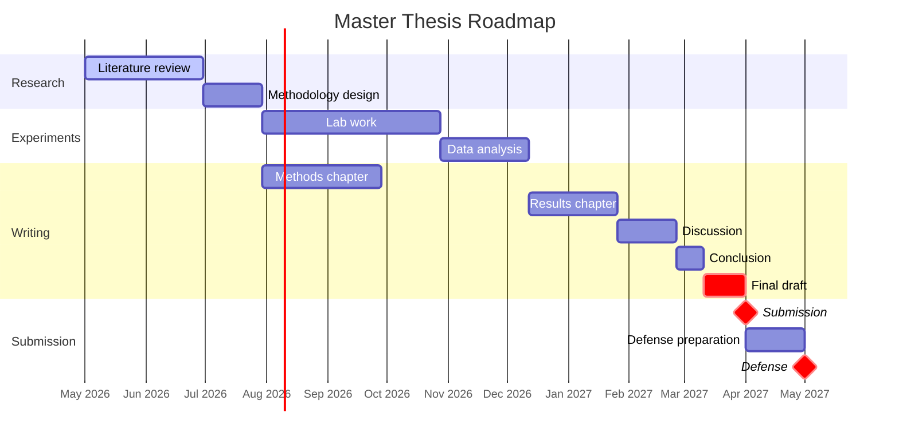

# Roadmap

High-level timeline for the thesis. Edit the Gantt chart below as dates shift; the milestones list tracks what has actually been completed.

The Mermaid syntax uses `after <id>` to chain dependencies, so changing one start date cascades through the chart. Use `crit,` to flag critical-path items and `milestone,` for zero-duration markers.

## Milestones

- [ ] Aufgabenstellung signed
- [ ] Literature review complete
- [ ] Methodology approved by supervisor
- [ ] Experiments started
- [ ] First results
- [ ] Methods chapter draft
- [ ] Results chapter draft
- [ ] Discussion chapter draft
- [ ] Full draft sent to supervisor
- [ ] Final revisions complete
- [ ] **Submission**
- [ ] Defense scheduled
- [ ] **Defense**

## Notes

- Start dates of all chained tasks shift automatically when the predecessor moves; no need to recalculate.
- Add or remove sections freely — Mermaid re-renders on every save.
- For finer-grained week-by-week tracking, install the [Tasks plugin](https://obsidian-tasks-group.github.io/obsidian-tasks/) and use `- [ ] task 📅 YYYY-MM-DD` syntax in your daily notes.
