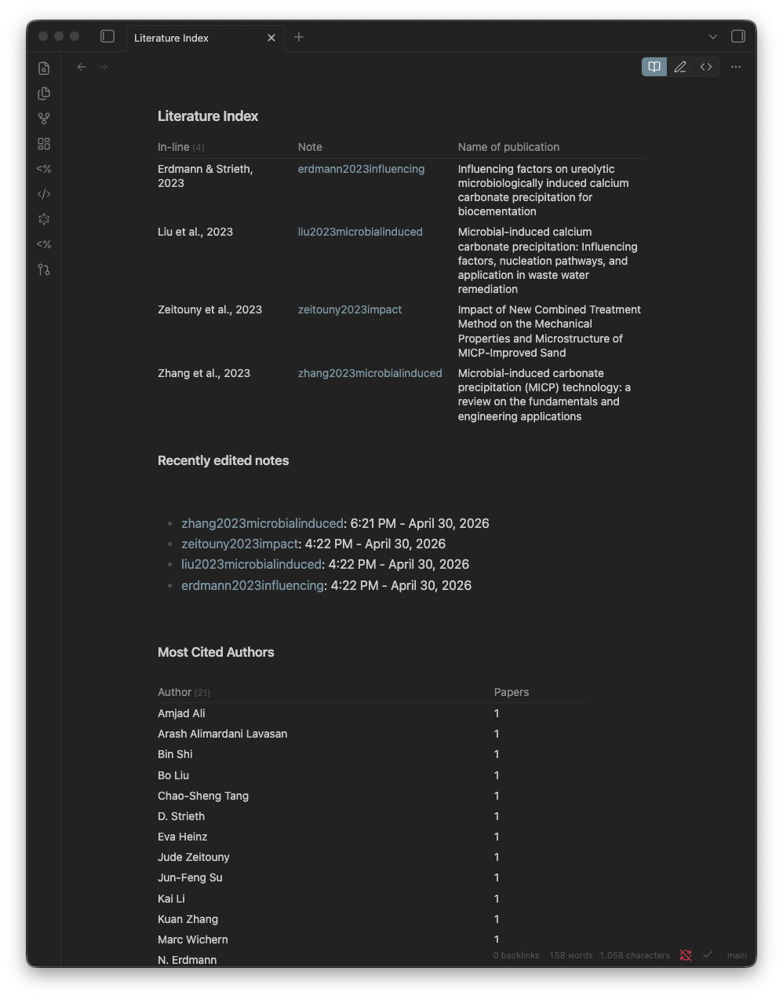
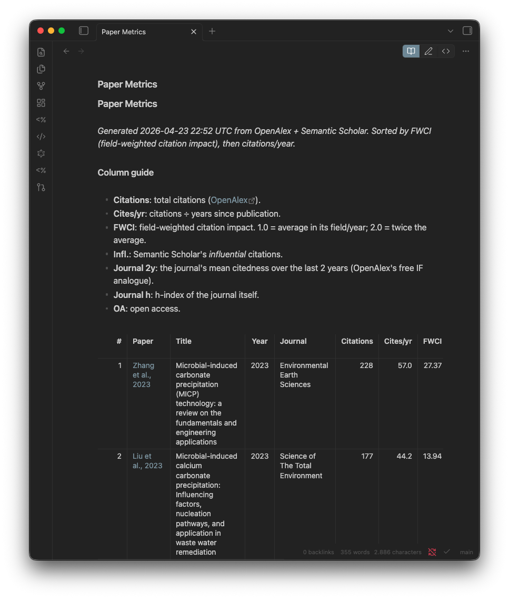
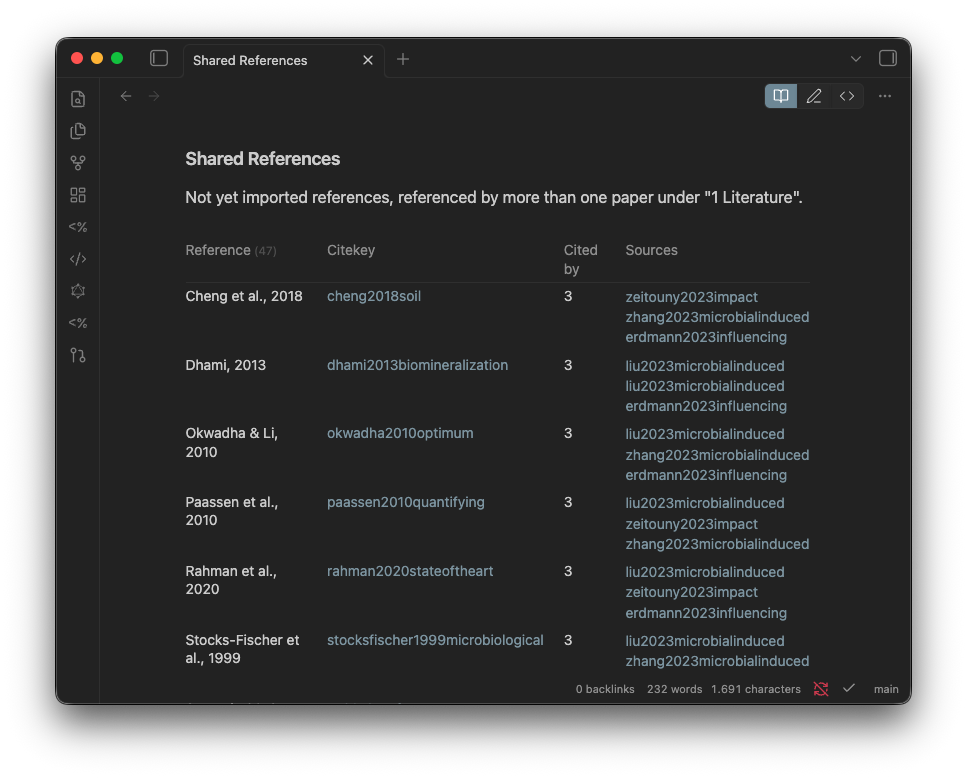
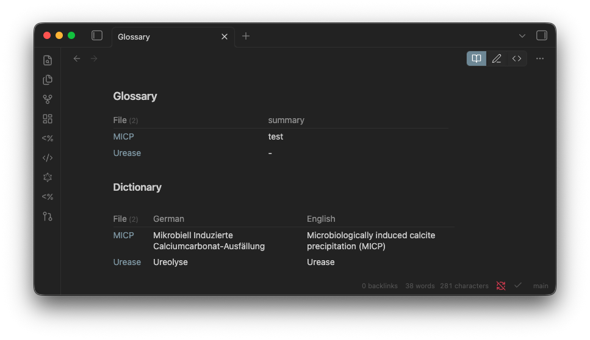

# The vault

The BibFlow vault has a fixed structure. Each folder has one role; the numeric prefixes hold the order in Obsidians file pane.

## Folder layout

| Folder                       | Holds                                                       |
|------------------------------|-------------------------------------------------------------|
| `0 Meta/Library/`            | dashboards over your library + Python helpers (auto-refreshed) |
| `0 Meta/Planning/`           | hand-edited project material (Roadmap, supervisor brief)    |
| `1 Literature/`              | one note per paper, named by its citekey                    |
| `2 Wiki/Concept Notes/`      | atomic ideas linked from many papers                        |
| `2 Wiki/Method Notes/`       | protocols, procedures, recipes                              |
| `3 Writing/`                 | drafts and exported chapters (start sections from the Draft Section Block template) |
| `7 Experiment Notes/`        | lab or empirical work (rename if not relevant)              |
| `8 Meeting Notes/`           | supervisor and reading-group notes                          |
| `9 Orga/`                    | templates, Templater commands, and `tp.user` helper scripts — never edited by hand |

## Navigating with wikilinks

Type `[[` anywhere; Obsidian autocompletes from existing notes. `[[chuo2020insights]]` jumps to that paper note; `[[MICP]]` jumps to the concept note. The Backlinks pane (right sidebar) shows everything that links back to the open note — instant context.

## Graph view

The right sidebars graph icon opens the **local graph** for the active note: which papers it cites, which concept notes it touches.

The left ribbons graph icon opens the **global graph view** for the whole vault.

Each literature note ends with a `## Cited works` list of the papers it references, populated by **Fetch References** (`fetch_references.py`). Every entry is a wikilink, so the note's local graph and Backlinks pane fill in automatically — and references shared across several papers surface in [Shared References](#shared-references).

## Search

| Shortcut       | What it does                                               |
|----------------|------------------------------------------------------------|
| Cmd+O          | jump to a note by name                                     |
| Cmd+Shift+F    | full-text search across the vault                          |
| Cmd+P          | command palette (any Obsidian or plugin command)           |
| Option+T       | the BibFlow Launcher (Templater commands)                  |

## Control notes (the `0 Meta/` folder)

These are dashboards, not content. They auto-populate from your literature notes — open them for a birds-eye view of your library.

### Roadmap

Mermaid Gantt chart of your thesis timeline plus a milestone checklist. Built from a single fenced `gantt` code block — no plugin needed; Obsidian renders Mermaid natively. Edit start dates and durations as the project shifts; chained tasks (`after <id>`) recalculate automatically.

Best treated as a high-level navigator. For week-by-week task tracking, layer the [Tasks plugin](https://obsidian-tasks-group.github.io/obsidian-tasks/) on top.

### Literature Index

Dataview-rendered list of every note in `1 Literature/` with year, journal, and intext citation. Answers "what have I read on X" without grep.

### Reading Queue

The same library, grouped by **reading status** instead of by name. Every paper in `1 Literature/` lands in one of `to-read`, `skimmed`, `referenced`, or `fully-read` — plus an **Unset** bucket so newly imported papers never slip through. Set a paper's status with **Set Reading Status** (Launcher); the board re-counts on its own. A live answer to "what's left to read?".

### Paper Metrics

Sortable table of citation counts, FWCI, journal h-index, and open-access status for every paper in your library. Generated by `fetch_metrics.py`; refresh via Launcher → **Refresh Paper Metrics**. A fast way to see which papers in your set are most cited in their field.

### Shared References

Papers cited by 2 or more of your literature notes — i.e. references that keep showing up across your reading. A reliable signal for foundational works you have not read yet. Click any unresolved entry to create that literature note instantly.

The same shared-references signal is also visible in the global graph view:

### Glossary

Dataview-rendered list of all concept notes in `2 Wiki/Concept Notes/`, showing each terms one-line definition.

Each row in the Glossary table is sourced from one concept note in `2 Wiki/Concept Notes/`. A concept note looks like this:

### Paper Search *(experimental)*

OpenAlex-backed keyword search. Define keyword and filter blocks in this notes `## Section` headers; run Launcher → **Paper Search**; ranked results land between auto-generated markers under each section. See [Templater commands](templater) for caveats and limitations.
