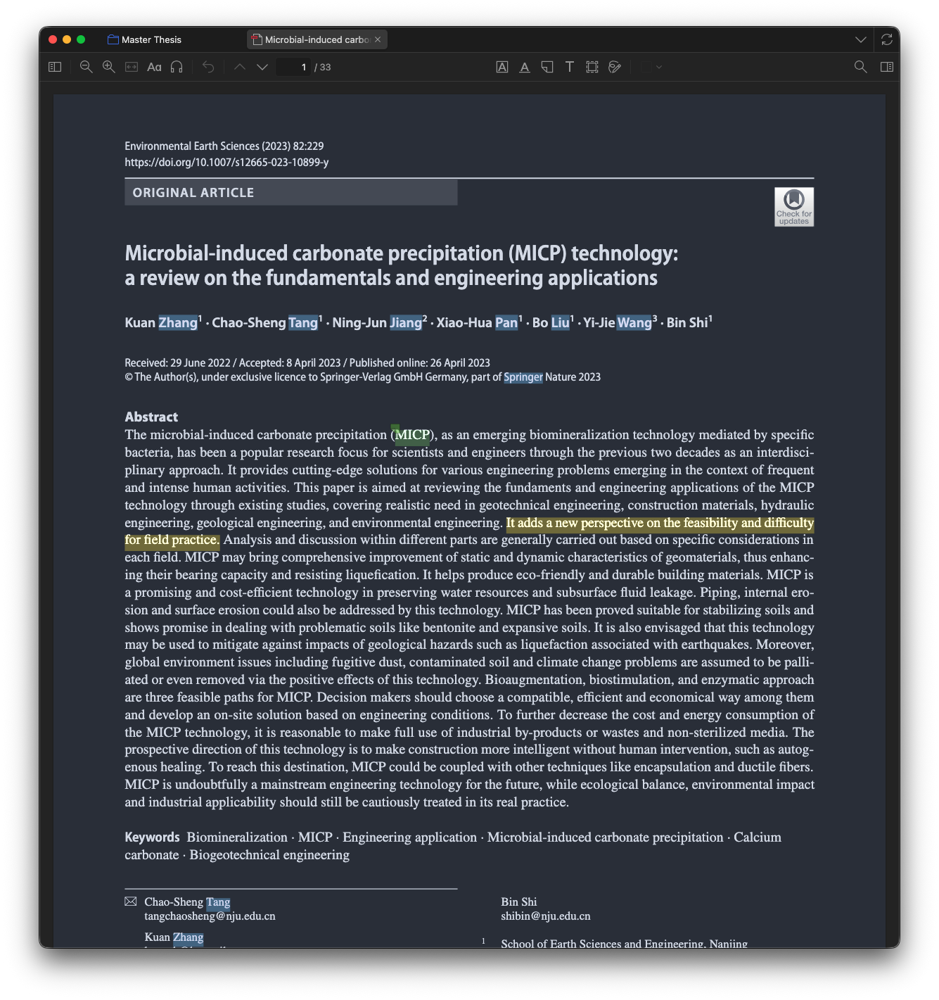
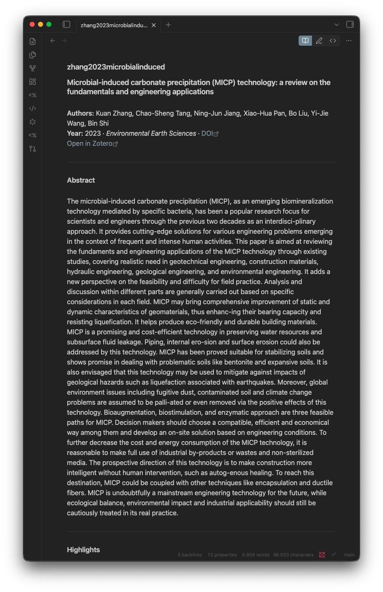
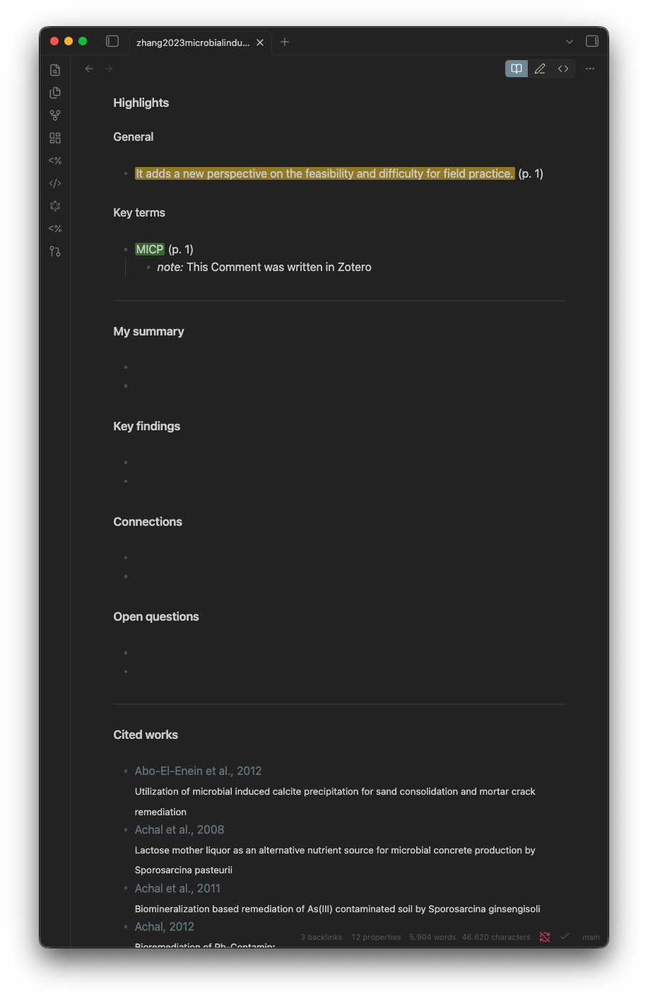

# Daily workflow

Six steps per paper.

## 1. Capture

Browser → click the Zotero Connector button on the paper page. Zotero saves metadata and PDF.

## 2. Read & annotate

Open the PDF in Zotero. Highlight:

- **Yellow** for claims, facts, useful prose.
- **Green** for terms and definitions to remember.

Add inline comments to highlights for reactions or open questions.

## 3. Import to Obsidian

Cmd+Shift+I (or Option+T → Import Paper from Zotero) → search title → Enter.

Creates `1 Literature/{{citekey}}.md` with metadata, highlights split by colour, and empty synthesis blocks.

## 4. Synthesise

Fill the persist blocks in your own words:

| Block          | Content                                              |
|----------------|------------------------------------------------------|
| Summary        | 3–5 sentences: what the paper does                   |
| Key findings   | bulleted concrete results                            |
| Connections    | wikilinks to other papers and concept notes          |
| Open questions | what you did not understand, what to investigate     |

Highlights are raw input. The synthesis is yours, and it survives Zotero re-imports.

> **Tip.** When a green-highlighted key term deserves its own atomic note, select it and run **Promote selection to concept note** from the Launcher. One keystroke creates `2 Wiki/Concept Notes/<term>.md` from the Concept Note template and replaces the selection with `[[<term>]]`. See [Templater commands](templater) for details.

## 5. Cite in your draft

Word: Zotero toolbar → Add Citation → search → insert.
LaTeX: `\parencite{citekey}`. Same citekey thats in Obsidian.

## 6. Backup

Nothing manual. Obsidian Git auto-commits every 30 minutes and pushes to your private GitHub repo.
